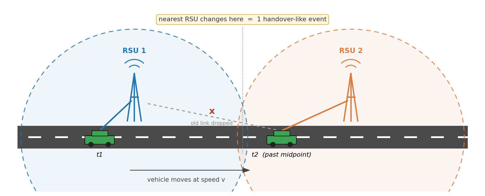
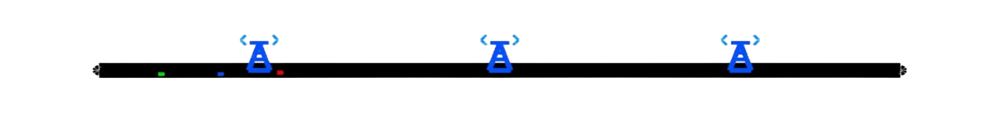
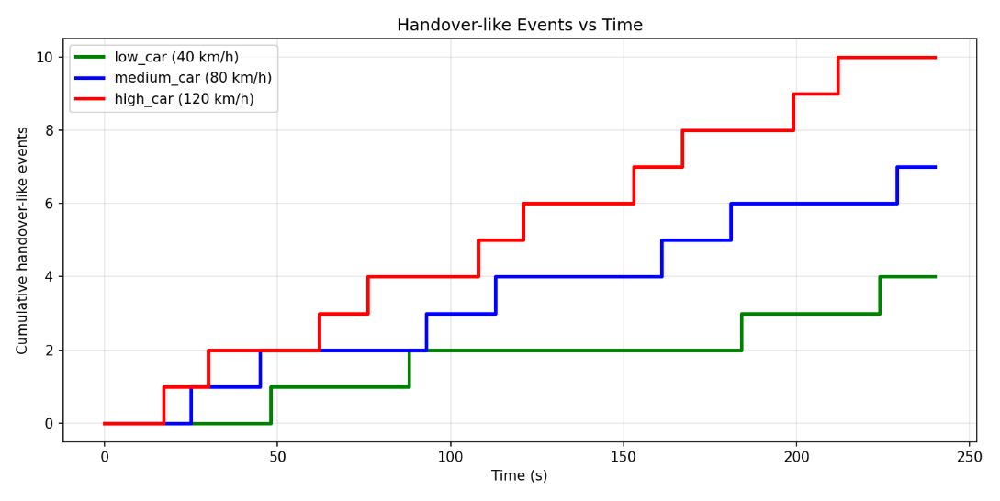
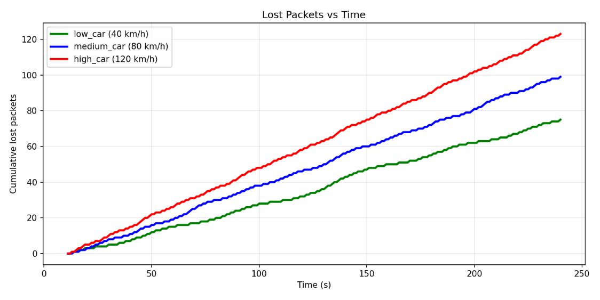

<!-- ============================================================
  BEFORE YOU PUBLISH — checklist for the team (delete this comment)
  1. Replace the presentation-video placeholder link below with your
     real YouTube (unlisted) URL, or drag-and-drop the mp4 into this
     README on github.com to embed an inline player.
  2. References [5]–[8] are reconstructed from the slide's shorthand.
     Replace them with the exact papers your team actually cited.
     [9] is a strong match — verify and add author names.
  3. Fill in the "Repository structure" section once you commit your
     SUMO config and Python analysis scripts.
============================================================ -->

# Faster Cars, Weaker Links: How Vehicle Speed Drives Handover and Packet Loss in V2I Networks

**Computer Networks — Group 11, Korea University Sejong Campus**
Lee Seok Hyeon · Im Hyo Jin · Lee Do Hyung · Ahn Jin Hwan

> 🎬 **Presentation video: https://drive.google.com/file/d/1ihQc_vqI6fG0983eNjbZNalIhzWIYn_7/view?usp=drive_link
> 🚗 **17-second simulation demo:** [media/simulation_demo.mp4](media/simulation_demo.mp4)

---

## TL;DR

We built a simplified Vehicle-to-Infrastructure (V2I) simulation with SUMO and Python to ask one question: **what does driving faster do to a vehicle's connection with roadside infrastructure?** Holding everything else fixed and sweeping vehicle speed across 40, 80, and 120 km/h, we observed that over the same 240-second run:

| Vehicle speed | Handover-like events | Cumulative lost packets |
|:---:|:---:|:---:|
| 40 km/h | 4 | ~75 |
| 80 km/h | 7 | ~99 |
| 120 km/h | 10 | ~123 |

Tripling the speed multiplied connection switches by 2.5× and increased packet loss by roughly 64%. Both effects grew near-linearly with speed, and the direction of every trend matches what published V2X studies report. The absolute numbers come from a deliberately simplified model — but the mechanism they illustrate is exactly why stable handover design matters for high-speed connected vehicles.

---

## 1. Problem

Autonomous and connected vehicles do not drive alone: they continuously exchange traffic information, hazard alerts, and driving-support data with road infrastructure. In a V2I setup, that infrastructure is a chain of **Roadside Units (RSUs)** — small base stations along the road that vehicles connect to one at a time [1].

This architecture has a built-in tension. An RSU only covers a limited stretch of road, so a moving vehicle must repeatedly **hand over** its connection from one RSU to the next. The faster the vehicle, the less time it spends inside each coverage area, and the more often that switch has to happen. Every switch is a moment of vulnerability, and time spent far from the serving RSU degrades the link.

So the question we set out to answer is simple to state:

> **How stable is V2I communication in a high-speed mobility environment — and how exactly does vehicle speed change handover frequency and packet loss?**

The answer matters because the applications riding on these links (collision warnings, cooperative driving) are the ones least able to tolerate dropped packets.

## 2. Background

Two and a half concepts are enough to follow everything below.

**V2X and V2I.** Vehicle-to-Everything (V2X) is the umbrella term for vehicles exchanging data with their surroundings — other vehicles (V2V), pedestrians (V2P), networks (V2N), and infrastructure (V2I) [1]. This project focuses on **V2I**: a vehicle communicating with stationary RSUs along the road.

**Handover.** When a moving vehicle leaves one RSU's coverage and enters the next one's, its connection must migrate. In real LTE/5G networks this is a multi-step protocol involving signal measurements and trigger conditions [3]. In this project we use a deliberately simplified, geometry-based proxy:

> **A *handover-like event* is recorded whenever the nearest connected RSU changes.**

<p align="center">
  
</p>

*Figure 1. Our handover-like event. While the vehicle is closest to RSU 1 (time t1), it stays connected to RSU 1. Once it passes the midpoint (t2), the nearest RSU becomes RSU 2, the old link is dropped, and one handover-like event is counted.*

**Packet loss.** Some transmitted packets never reach their destination — if a vehicle sends 100 packets and 20 fail to arrive, packet loss is 20. Distance from the RSU weakens the link, and high speed shortens the windows of stable connectivity, so both factors push loss upward.

## 3. Our Approach: A Deliberately Simple Simulation

We did **not** implement an actual LTE/5G protocol stack. Instead, we built a controlled, simplified simulation where vehicle speed is the only variable that changes between runs — making any difference in the results attributable to speed alone. (Section 6 discusses what this choice buys us and what it costs.)

### 3.1 Environment

We used **SUMO** (Simulation of Urban MObility) [2] to generate realistic vehicle movement on a highway-like straight road, and **Python** to process the resulting position data.

<p align="center">
  
</p>

*Figure 2. The simulated highway with 3 RSUs (blue towers). The three small dots on the road are the test vehicles of each speed class.*

| Component | Setting |
|---|---|
| Road | Highway-like straight road built in SUMO |
| RSUs | 3, placed along the road |
| Connection rule | Each vehicle connects to its **nearest** RSU |
| Handover rule | A handover-like event is recorded when the connected (nearest) RSU changes |
| Speed conditions | **40 km/h** (low) · **80 km/h** (medium) · **120 km/h** (high) |
| Traffic | Packets sent every 1 second per vehicle |
| Run length | ~240 s of simulation time |

A short clip of the running simulation: [media/simulation_demo.mp4](media/simulation_demo.mp4).

### 3.2 Processing pipeline

For every simulation step, the Python script:

1. reads each vehicle's position and speed from SUMO,
2. computes the distance between the vehicle and every RSU,
3. assigns the vehicle to the nearest RSU,
4. counts a handover-like event whenever that assignment changes, and
5. decides for each 1-second packet whether it is lost.

### 3.3 Packet-loss model

Packet loss is modeled probabilistically rather than through a wireless channel simulation. For each transmitted packet, the loss probability **increases with the vehicle's distance from its serving RSU** and **increases with the vehicle's speed**. This captures the two first-order effects we care about — weak links at cell edges, and instability under fast motion — in a form that stays fully interpretable.

## 4. Results

Both result graphs below are cumulative counts over the same 240-second window, with one line per speed class (green = 40 km/h, blue = 80 km/h, red = 120 km/h).

### 4.1 Handover-like events vs. time

<p align="center">
  
</p>

*Figure 3. Cumulative handover-like events. Each vertical step is one RSU switch. The high-speed vehicle ends at 10 events, the medium at 7, the low at 4.*

The staircase shape makes the mechanism visible: each step is the moment a vehicle crosses the midpoint between two RSUs (Figure 1). Three observations follow directly from the graph:

- **The red staircase climbs fastest.** At any fixed time point, the 120 km/h vehicle has accumulated more events than the 80 km/h vehicle, which has more than the 40 km/h vehicle.
- **Steps come at shorter intervals as speed rises.** The high-speed vehicle's dwell time inside each coverage area is shorter, so switches arrive more frequently.
- **Scaling is close to linear in speed.** This is what the geometry predicts: with a nearest-RSU rule, the number of boundary crossings in a fixed time window grows in proportion to the distance covered, which is proportional to speed. The observed 4 → 7 → 10 progression for 40 → 80 → 120 km/h tracks that linear expectation closely; the small deviation from a perfect 1:2:3 ratio is expected from finite road length and the discrete times at which positions are sampled.

Putting it as a causal chain:

> **Higher speed → shorter RSU dwell time → more frequent connection switching.**

### 4.2 Lost packets vs. time

<p align="center">
  
</p>

*Figure 4. Cumulative lost packets. Final totals: ~123 (120 km/h) > ~99 (80 km/h) > ~75 (40 km/h).*

Loss accumulates almost linearly in time for every speed class — meaning each vehicle experiences a roughly constant average loss rate — but the **slope** of that line is what speed changes. Two patterns stand out:

- **The ordering never flips.** From early in the run to the end, the faster vehicle always has more cumulative loss. This is not a late-run artifact; the gap opens early and widens steadily.
- **Each +40 km/h adds a near-constant penalty.** The final totals (75, 99, 123) are separated by almost exactly 24 packets per speed step — again a near-linear dependence on speed, mirroring the handover result.

The mechanism: a faster vehicle's distance to its serving RSU changes more per second, so it spends a larger share of each cell crossing in the weak edge region, and its stable-connection windows are shorter. In our model both effects raise the per-packet loss probability, and the cumulative curves integrate that into a visibly steeper slope.

> **Higher speed → lower connection stability → more packet loss.**

One honest caveat belongs right next to this result: because our loss model includes speed as an explicit input (Section 3.3), Figure 4 should be read as *demonstrating the mechanism and its magnitude under our assumptions*, not as independent proof that speed causes loss. The independent support comes from the literature — which is the next section.

## 5. Sanity Check: Does This Match Published Research?

A simplified model is only useful if its trends point the same way as real systems. We compared our two findings against five prior studies:

| Prior work | What it studied | How it connects to our results |
|---|---|---|
| C-V2X Mode 4 PDR analysis at 40/80/120 km/h (2022) [5] | Packet delivery ratio across the same three speed tiers | Independently uses 40/80/120 km/h as representative low/medium/high speeds — supporting our choice of speed conditions |
| LTE handover study, 3–170 km/h (2018) [6] | Handover behavior across a wide speed range | Reports that handover rate increases with UE speed — matching Figure 3 |
| VANET AODV evaluation at 60/80 km/h (2022) [7] | PDR, delay, and overhead vs. speed | Confirms PDR decreases (loss increases) as speed rises — matching Figure 4 |
| IEEE 802.11p mobility study (2012) [8] | Impact of mobility on communication performance | Supports the general conclusion that mobility degrades link quality |
| Real-road LTE/5G field test, *Sensors* (2022) [9] | Measurements with real devices on a test track | Shows distance and speed affecting real-world V2V/V2I performance — the real-system analogue of our distance- and speed-based model |

The consistent picture across very different methodologies — analytical models, protocol simulations, and physical drive tests — is the same one our simplified simulation produces: **mobility is expensive for vehicular links, and speed is the price multiplier.**

## 6. Trade-offs

Every design choice in this project trades realism for control. We made those trades deliberately, and they cut both ways:

| Our choice | The heavier alternative | What we gained | What we gave up |
|---|---|---|---|
| Nearest-RSU "handover-like" events | Full LTE/5G handover (RSRP/SINR measurements, A3 trigger, time-to-trigger, X2/NG signaling) [3], [4] | A zero-parameter rule that isolates the pure geometry-and-speed effect; every event in Figure 3 is explainable | No ping-pong handovers, no handover failures or interruption time — so our event counts are not real handover counts |
| Distance- and speed-based probabilistic loss | Wireless channel models (path loss, fading, interference) | A monotonic, interpretable model with two knobs that map directly to our hypothesis | Absolute loss numbers carry no physical meaning; no burst losses or interference effects |
| Straight 1-D highway, 3 RSUs | Real road topology, dense RSU deployments | A controlled experiment where speed is the only independent variable | No intersections, terrain, shadowing, or RSU-density effects |
| One vehicle per speed class | Full traffic with channel contention | Clean per-speed curves with no cross-traffic noise | No congestion or load-dependent behavior |

The overall trade is the classic one between a **trend analysis** and a **performance prediction**. We chose the trend side: the directions and relative magnitudes in Figures 3–4 are trustworthy and fully explainable, while the absolute values (10 handovers, 123 lost packets) are artifacts of our parameters and should not be quoted as LTE/5G performance.

## 7. Limitations

Beyond the trade-offs above, two gaps between our simulation and real systems deserve explicit mention.

**Real handover is a protocol, not a geometry check.** Actual LTE/5G handover is driven by radio measurements — RSRP (Reference Signal Received Power) and SINR (Signal-to-Interference-plus-Noise Ratio) — evaluated against trigger conditions such as event A3, sustained for a configured time-to-trigger, and executed over inter-station interfaces (X2 in LTE, NG/Xn in 5G) [3], [4]. Each of those mechanisms exists precisely to suppress the unstable switching our naive nearest-RSU rule happily counts.

**Real packet loss has many more causes.** Radio interference, obstacles, terrain, weather, wireless channel conditions, and surrounding traffic density all affect loss in deployed networks — none of which our two-variable model represents.

In short: this result does not represent actual LTE/5G performance; it shows a simplified trend in a high-speed mobility environment.

## 8. Conclusion

**What we did.** Built a simplified high-speed V2I environment with SUMO and Python, swept vehicle speed across 40/80/120 km/h, and measured handover-like events and packet loss under identical conditions.

**What we found.** Higher speed produced more handover-like events (4 → 7 → 10) and more packet loss (~75 → ~99 → ~123), with both effects scaling near-linearly in speed. High-speed vehicles switched RSU connections more often and held less stable links.

**Why it matters.** Vehicles at highway speed sweep through RSU coverage areas in seconds. Any V2I service that assumes a stable link — which is to say, any safety-critical V2I service — must be engineered around exactly the two costs we measured. Our numbers are a trend analysis rather than a performance prediction, but the trend is the point: **as speed goes up, communication stability goes down, and the network design has to pay for the difference.**

---

## Repository structure

```text
.
├── README.md
├── assets/                  # figures used in this post
│   ├── fig1_handover_concept.png
│   ├── fig2_sumo_environment.png
│   ├── fig3_handover_events_vs_time.png
│   └── fig4_lost_packets_vs_time.png
├── media/
│   └── simulation_demo.mp4  # 17-second SUMO demo clip
└── (TODO: add SUMO config — highway.net.xml / highway.rou.xml — and the
   Python analysis script so results can be reproduced)
```

## References

[1] 3GPP TS 22.185, *Service requirements for V2X services*, Release 14.

[2] P. A. Lopez et al., "Microscopic Traffic Simulation using SUMO," in *Proc. IEEE Intelligent Transportation Systems Conference (ITSC)*, 2018, pp. 2575–2582. https://sumo.dlr.de

[3] 3GPP TS 36.331, *E-UTRA; Radio Resource Control (RRC); Protocol specification* — measurement reporting (event A3) and time-to-trigger.

[4] 3GPP TS 36.300, *E-UTRA and E-UTRAN; Overall description* — X2-based handover procedure.

[5] <!-- TODO verify --> C-V2X Mode 4 packet-delivery-ratio analysis at 40/80/120 km/h, 2022. *(Replace with the exact paper cited in the presentation.)*

[6] <!-- TODO verify --> LTE handover analysis at 3–170 km/h, 2018. *(Likely candidate: "A Simulation Study on LTE Handover and the Impact of Cell Size," 9th EAI Int. Conf. on Broadband Communications (BROADNETS), 2018 — verify against the paper your team used.)*

[7] <!-- TODO verify --> VANET AODV performance evaluation (PDR, delay, overhead) at 60/80 km/h, 2022. *(Replace with the exact paper cited in the presentation.)*

[8] <!-- TODO verify --> Impact of mobility on IEEE 802.11p communication performance, 2012. *(Replace with the exact paper cited in the presentation.)*

[9] "Connected Vehicles: V2V and V2I Road Weather and Traffic Communication Using Cellular Technologies," *Sensors*, vol. 22, no. 3, art. 1142, 2022. https://doi.org/10.3390/s22031142 *(verify authors)*

---

*This project was carried out as a team project for the Computer Networks course at Korea University Sejong Campus.*
